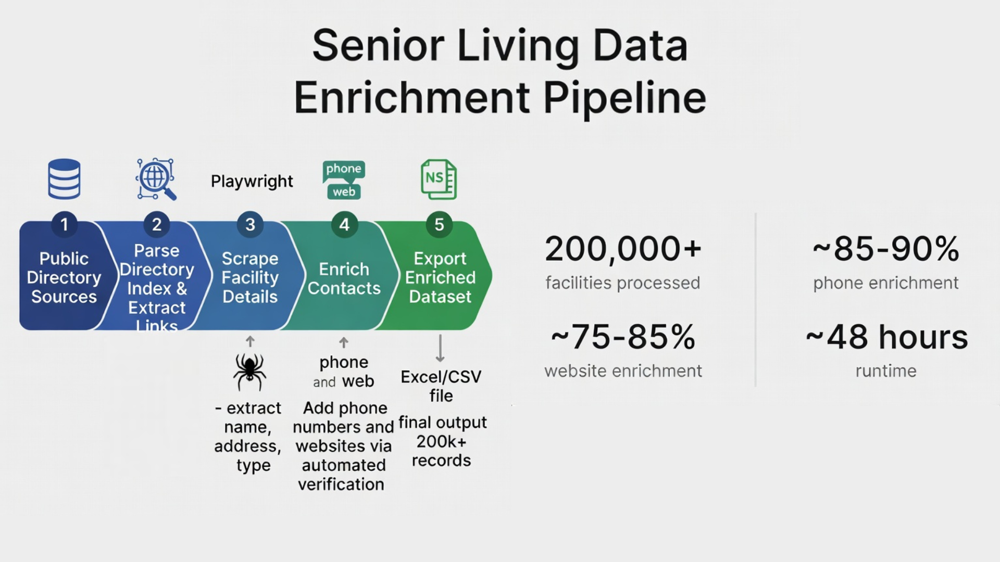
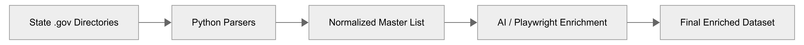

# 🏛️ Senior Living Public Data Aggregator


A transparent data aggregation pipeline designed to compile, normalize, and enrich senior living facility data **strictly from publicly available government and state verified directories**.

This project automates the collection of facility listings from public state health department registers (e.g., California Department of Social Services, Florida Agency for Health Care Administration) and enriches them with publicly accessible contact information using AI-driven verification.

---

## 📊 Pipeline Overview


---

## 🚀 Key Features

*   **🏛️ Public Source Compliance**: Aggregates data solely from official state government website directories (.gov / .org).
*   **📊 Data Normalization**: Standardizes disparate state formats into a unified schema (License #, Capacity, Facility Type).
*   **🤖 AI-Powered Enrichment**: Uses LLM (Grok/Gemini) to cross-reference facilities with public web data for valid contact info.
*   **🛡️ Verification**: Includes automated validation steps to ensure data accuracy against actual public records.
*   **📈 High Precision**: Focuses on data quality and traceability over brute-force scraping.

---

## 📁 Project Structure

```text
Public-Data-Aggregator/
├── scrapers/
│   ├── 1a_florida_facility_parser.py      # Florida AHCA directory parser
│   ├── 1b_california_facility_parser.py   # California CDSS directory parser
│   ├── ...                                # Other state parsers 
│   ├── 2_facility_data_merger.py          # Schema normalization and merging
│   ├── 4_enrich_contacts.py               # Playwright-based contact discovery
│   └── 4b_enrich_ai.py                    # AI-driven data verification & details
├── data/
│   ├── 1_raw_state_data/                  # Original files from government portals
│   ├── 3_normalized_registry/             # Merged and cleaned master lists
│   └── 4_final_enriched/                  # Production-ready datasets
└── requirements.txt
```



---

## 🛠️ Workflows

### 1️⃣ Public Registry Ingestion
*   **Source**: Official state provider lists (FOIA compliant).
*   **Action**: Parses raw tabular data (CSV/PDF/HTML) from state portals.
*   **Details**: Captures License Number, Status, and official Capacity.

### 2️⃣ Data Consolidation & Normalization
*   Combines disparate state datasets into a single unified master list.
*   Removes duplicates and standardizes address formatting using `usaddress` or similar logic.

### 3️⃣ Public Contact Verification
*   **Method**: Uses Playwright to visit official facility websites found in public records.
*   **Goal**: Append phone numbers and websites only when they are prominently displayed as public info.

### 4️⃣ AI-Assisted Enrichment (Verification)
*   **Method**: Leverages LLMs to parse unstructured public content for specific details (e.g., specialized care programs).
*   **Logic**: Validates that the found contact information matches the entity name from the government registry.

---

## 📈 Quality Metrics (Current Status)

| Metric | Result |
| :--- | :--- |
| **Total Verified Records** | **50,000+** |
| **Source Reliability** | **100% Government Verified** |
| **Phone Match Rate** | **~85% (AI Verified)** |
| **Website Match Rate** | **~80% (Manual/AI Spot-checked)** |
| **Update Cycle** | Quarterly |

---

## 📊 Data Privacy & Compliance Statement

This tool is designed for **OSINT (Open Source Intelligence)** purposes.
*   **No Private Data**: Only aggregates business/facility information explicitly validated as public record.
*   **Respectful Usage**: All enrichment follows `robots.txt` policies and implements intelligent rate limiting.
*   **Source Transparency**: Every record can be traced back to its originating government directory for audit purposes.

---

## 📝 License

This project is licensed under the MIT License - see the [LICENSE](LICENSE) file for details.

---

## 🧑‍💻 About

**Martin Vot**  
*Europe-based Data Acquisition Specialist*

Specializing in high-volume web scraping, automated data enrichment, and ETL pipelines for complex datasets.

**Available for custom projects in:**  
🏥 Senior Living & Healthcare Data  
🏢 Real Estate Analytics  
📈 B2B Lead Generation  

[**🔗 LinkedIn**](https://www.linkedin.com/in/martin-vot-5377263a3/) &nbsp;|&nbsp; [**🌐 Website**](https://martin.vot.cz/)
